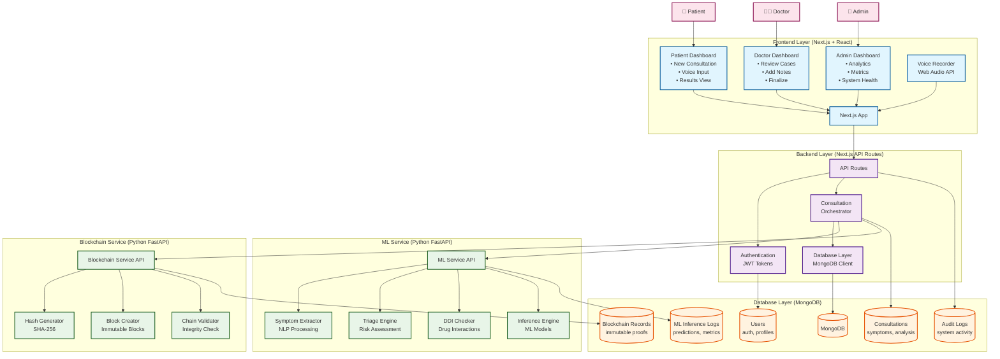
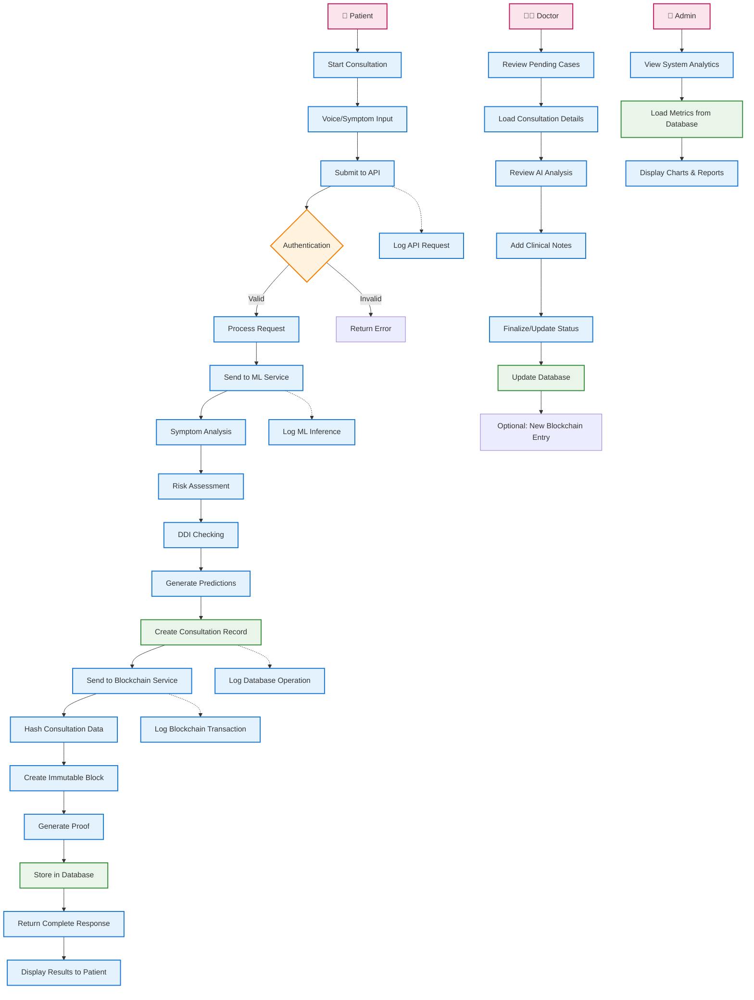

## Architecture Summary

### **System Overview**
AarogyaGuard is a multi-language AI-powered healthcare assistant with blockchain-backed secure record storage, built with a microservices architecture.

### **Key Components**

1. **Frontend Layer** (Next.js + React)
   - Patient, Doctor, and Admin interfaces
   - Voice-based symptom collection
   - Real-time consultation management

2. **Backend Layer** (Next.js API Routes)
   - Authentication & authorization
   - Service orchestration
   - Database operations

3. **ML Service** (Python FastAPI)
   - Symptom analysis & disease prediction
   - Risk level assessment
   - Drug-drug interaction checking

4. **Blockchain Service** (Python FastAPI)
   - Immutable consultation records
   - Cryptographic hashing
   - Chain integrity verification

5. **Database Layer** (MongoDB)
   - User management
   - Consultation storage
   - Audit logging
   - Analytics data

### **Technology Stack**
- **Frontend**: Next.js 16, React 19, TypeScript, Tailwind CSS
- **Backend**: Next.js API Routes, TypeScript
- **AI/ML**: Python FastAPI, scikit-learn, NumPy
- **Blockchain**: Python FastAPI, Custom implementation
- **Database**: MongoDB with aggregation pipelines
- **Infrastructure**: Docker, Docker Compose

### **Security Features**
- JWT-based authentication
- Role-based access control
- Input validation & sanitization
- HTTPS encryption
- Audit logging

### **Scalability Considerations**
- Microservices architecture
- Database connection pooling
- Service health monitoring
- Structured logging
- Containerized deployment